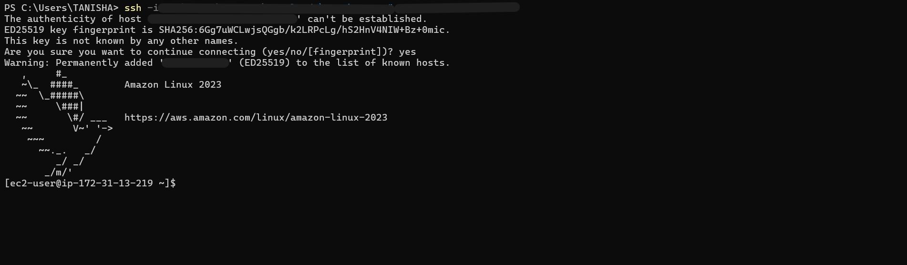

# 🚀 AWS Auto Scaling - Real Production Implementation

> **Hands-on learning of AWS Auto Scaling in production environments**

[](https://www.linkedin.com/posts/tanisha-kushwah-280944284_aws-devops-cloudengineering-activity-7411019541679407104-AYrC)
[](https://aws.amazon.com/autoscaling/)

---

## 📌 What is Auto Scaling?

**Auto Scaling = Automatic EC2 instances management based on demand**

✅ Traffic ↑ → Instances ↑  
✅ Traffic ↓ → Instances ↓  
✅ Cost Optimization + High Availability

---

## 🛠️ Implementation Steps

### Step 1️⃣: Create Launch Template


**Launch Template = Blueprint for EC2 instances**
- AMI, Instance Type, Security Groups, Key Pair

---

### Step 2️⃣: Launch Instances


---

### Step 3️⃣: Configure Auto Scaling Group


**Key Settings:**
- Min: 2 | Desired: 4 | Max: 10
- Health Checks: EC2 + ELB
- Multi-AZ for High Availability

---

### Step 4️⃣: Testing via CLI


---

## 🎯 Real Production Scenario


---

## ⚡ How It Works

```
CloudWatch Monitors → Alarm Triggers → Auto Scaling Acts → ELB Distributes Traffic
```

1. **Monitor** - CloudWatch tracks CPU, Memory, Custom Metrics
2. **Trigger** - Threshold breach → Alarm fires
3. **Scale** - Add/Remove instances automatically
4. **Distribute** - Load Balancer routes traffic to healthy instances
   
---

## 💡 Key Learnings

| Topic | Learning |
|-------|----------|
| **Scaling Policies** | Target Tracking > Step Scaling > Simple Scaling |
| **Health Checks** | EC2 + ELB = Best combo |
| **Multi-AZ** | Must for production |
| **Cooldown** | Prevents rapid scaling |
| **Cost** | Spot Instances + Right-sizing = 💰 Savings |

---

## 📊 Metrics to Monitor

- 🔴 CPU Utilization
- 🟢 Network In/Out
- 🟡 Request Count
- 🔵 Custom Metrics

---

## 💰 Cost Optimization Tips

✅ Spot Instances for non-critical workloads  
✅ Scheduled Scaling for predictable patterns  
✅ Right-size instances  
✅ Reserved Instances for baseline

---

## 🔗 Resources

- 📘 [AWS Auto Scaling Docs](https://docs.aws.amazon.com/autoscaling/)
- 🏗️ [AWS Well-Architected Framework](https://aws.amazon.com/architecture/well-architected/)

---

## 🤝 Connect With Me

[](https://www.linkedin.com/in/tanisha-kushwah-280944284/)

📝 **Read my detailed LinkedIn post:** [AWS Auto Scaling Journey](https://www.linkedin.com/posts/tanisha-kushwah-280944284_aws-devops-cloudengineering-activity-7411019541679407104-AYrC)

---

⭐ **If this helped you, please star this repo!**

---

**#AWS #DevOps #CloudEngineering #AutoScaling #LearningInPublic**
